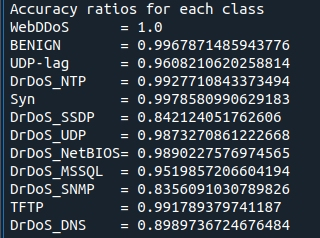
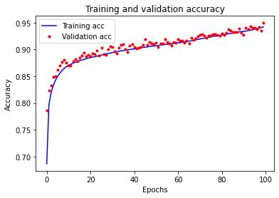
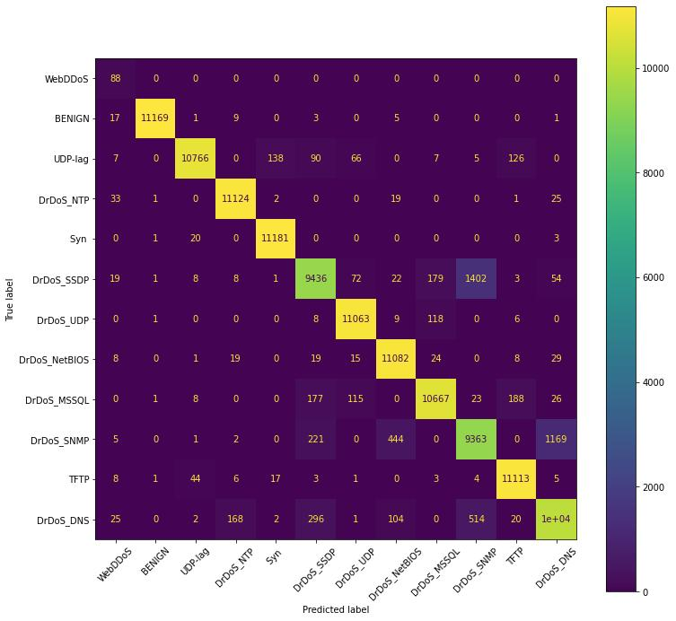

##Deep Learning Based Intrusion Detection 

Example output:

# Please cite below works if you find it useful:
[Akgun, Devrim, Selman Hizal, and Unal Cavusoglu. "A new DDoS attacks intrusion detection model based on deep learning for cybersecurity." Computers & Security 118 (2022): 102748 ](https://www.researchgate.net/publication/360327782_A_New_DDoS_Attacks_Intrusion_Detection_Model_Based_on_Deep_Learning_for_Cybersecurity)

[Hizal, Selman, Ünal ÇAVUŞOĞLU, and Devrim AKGÜN. "A New Deep Learning Based Intrusion Detection System for Cloud Security." 2021 3rd International Congress on Human-Computer Interaction, Optimization and Robotic Applications (HORA). IEEE, 2021](https://www.researchgate.net/publication/352811809_A_new_Deep_Learning_Based_Intrusion_Detection_System_for_Cloud_Security)
